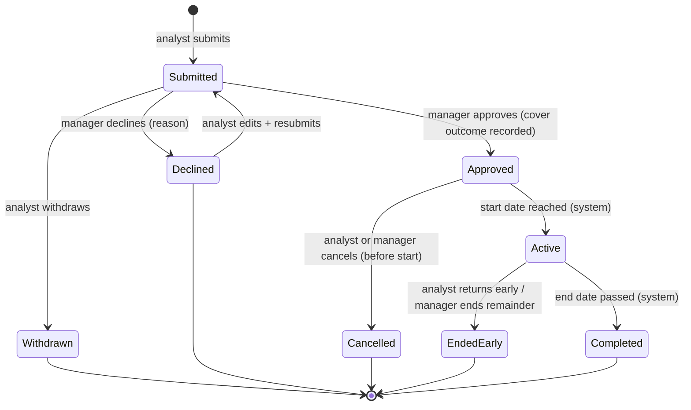

# EXAMPLE — Team Time-Off & Coverage — J-1: request-approval

> Synthetic worked example for the fictional product **Beacon**, a B2B data-enrichment SaaS billed in usage credits. This is the buildable contract for one job of the [Team Time-Off & Coverage](../../initiatives/time-off-requests.md) initiative — the level between the [PRD](time-off-requests-prd.md) (why this bet) and tickets (who builds what), drafted by `/job-spec-draft` from the [breakdown](time-off-requests-jobs-breakdown.md)'s J-1 row. Every number below is invented. Use this as a shape reference next to [the blank template](../../handbook/templates/job-spec-template.md).

Workspace time-off: an analyst requests dates and proposes a cover, the workspace manager decides, and the whole team sees who's out and who covers. The absence object this creates — including the named cover — is the contract J-2 later routes duties on.

| ID | Type | Parent | Effort | Priority — why | Depends on | Status | Updated |
|----|------|--------|--------|----------------|-----------|--------|---------|
| J-1 | Net new | [PRD](time-off-requests-prd.md) · [breakdown](time-off-requests-jobs-breakdown.md) | [Eng to confirm] | Must — walking skeleton; J-2/J-3/J-4 all consume its absence object and decision flow (breakdown §3) | — | Draft | 2026-08-13 |

## 1) Why this exists

Two workspace duties are personal and neither survives an absence: enrichment jobs above the org's auto-approve threshold wait for a workspace approver, and credit-burn alerts route to one named watcher (PRD — invented universe). In Q2, 9 of Beacon's 52 Growth+Scale orgs filed `coverage-gap` tickets ("job stuck — approver on vacation", "balance ran dry while the watcher was away"), and 3 enterprise prospects named absence handling in security reviews. Today's workarounds are shared logins — which Beacon explicitly prohibits — and standing check-ins that exist only to ask "who's out next week?". Nothing in the product records who is away or who stands in; no current-state facts are code-verified (no grounded code access — §9).

## 2) Outcome

Teams put time-off requests and decisions inside the workspace: managers decide each request with the cover question answered explicitly (a named teammate or a recorded no-cover choice), and anyone can see who's out and who covers without asking. The wall calendar and the "who's out?" check-in stop being load-bearing.

## 3) Job story

When I plan time away (or wake up sick), I want my time off agreed and my cover settled in the same place our enrichment work runs, so the team knows who's out and who's on the hook before I'm gone.

## 4) The slice

**Riskiest assumption this job tests:** teams move requests + decisions into the workspace and name covers unprompted — the first read on the ≥ 80% cover-assignment target (breakdown J-1 row; PRD — invented universe).
**The backbone (full flow, for context):** request → decide (cover settled) → team sees → absence starts: duties route to cover (J-2) → absence ends: duties revert → no stalled jobs, no unwatched balances.
**What this slice covers:** submit through decide through team visibility through system activation/completion of the absence. The loop closes at "complete, visible absence data" — duty *routing* deliberately does not happen here (J-2's seam), but every field routing needs exists and is current.
**Preconditions & inherited dependencies:** none — first job. Uses only existing platform facts: workspace membership, plan tier, the notification service.

## 5) Variations — who does this differently

Checked, not material: vertical, org size within Growth+Scale, data/integration maturity, tenure, migration state (net-new object — no historical data). Language: unknowable — platform-model §6 unfilled, carried in §10/§13. Accessibility: §10 row 1.

| Variation | Who (reach, sourced) | Differs how | Priority — grounded | In this job? |
|-----------|----------------------|-------------|---------------------|------------------|
| EU orgs | 14 of 52 (PRD — invented universe) | Nuance — note + decline reason are personal data: visibility + minimization rules; records are coverage-planning, **not** statutory-leave records (PRD non-goal) | Must (auto — privacy) | Yes — R-9/R-10, §9 |
| Plan gating | 52 Growth+Scale in (PRD — invented universe); Starter counts unknown | Nuance — eligibility rule; Starter presentation (absent vs locked) undecided | Must — the buying segment | Yes — R-12; Starter question → §13 |
| Manager is the requester | Reach unsourced `[Hypothesis — needs validation]` | **Branch** — the decide step differs: someone else must decide (delta below) | Must *(provisional — blocked-loop severity, unsourced frequency)* → §13 | Yes — invariant in; fallback mechanism open |
| Unplanned "out today" | PRD problem says "planned or not"; no count `[Partial]` | **Branch** — absence effective before decision (delta below) | Should *(provisional)* → §13 | Proposed yes — decision open (breakdown §4 #5) |
| Multi-workspace membership | Reach unsourced `[Hypothesis — needs validation]` | Nuance — where one person's absence surfaces; overlap-rule scope | Could *(provisional)* → §13 | v1 floor: per-workspace (E-scope); full answer → breakdown §4 #6 |
| First-run / empty state | All 52 orgs at turn-on (PRD — invented universe) | Nuance — zero absences and zero configuration on day one | Must — first impression of every org | Yes — §10 row 5, AC |

**Branch deltas (the delta only):**
- *Manager is the requester:* submit/withdraw/cancel identical; the decision must come from another holder of decide rights — `decided-by ≠ requester` is an enforced invariant (R-8). Who that other decider is (second manager, org-admin fallback) is the open mechanism (§13 #3); the state machine is unchanged — the branch lives in the transition guard, not new states.
- *Unplanned "out today":* the person is out effective immediately; the record enters the team view at once and the decision follows (retroactive approve/decline with honest dates — see E9). Whether a manager can record it on the analyst's behalf is open (§13 #2); if adopted, recorded-by is stored and visible — never shared credentials (§9).

## 6) Capabilities & flow

**Places:** the workspace's [time-off] area — [new-request] (any member) · [decide-queue] (deciders' pending list) · [whos-out] (team view: current + upcoming absences with covers) · [my-requests] (own requests, all states, with history).
**Actions:** submit dates + optional note + proposed cover · withdraw (while Submitted) · edit + resubmit (after Declined) · decide: approve recording a cover outcome, or decline with reason · change cover on an Approved/Active absence · cancel (Approved, before start) · end early (Active) · read who's out.
**Where each action leads:** submit → the request appears in every decider's [decide-queue], deciders notified · decision → requester notified (decline carries the reason); on approve the named cover is notified and [whos-out] updates · start/end date → system activates/completes the absence; the cover is notified on and off visibility duty · withdraw / cancel / end-early / cover-change → the queue or view updates and released/affected parties are notified (R-11).

**Time-off request fields** (new object):

| Field | What it is | Required / derived / system-set |
|-------|------------|--------------------------------|
| requester | the workspace member the absence is about | system-set at submit (on-behalf open — §13 #2) |
| workspace | the workspace the request lives in | system-set |
| start_date, end_date | requested span, date-only, end-inclusive (R-12) | required; end ≥ start; single day valid |
| effective_end | the real last day out — set on end-early, equals end_date on completion | system/manager-set |
| note | requester's free text to the deciders | optional (R-9) |
| cover_outcome | a named cover (workspace member) **or** an explicit no-cover choice with optional reason | required at approval (R-2) |
| status | the state machine below | system-set |
| history | append-only: every decision, manual transition, and cover change — actor, timestamp, reason where required | system-set (R-7) |

Withdrawn, Declined (unless resubmitted), Cancelled, EndedEarly, Completed are deliberately terminal — no un-cancel or reopen; the path back is always a new request (audit clarity). A request still Submitted when its start date arrives sits in E2 (open). This status enum is the cross-job contract J-2/J-3/J-4 consume — settle it before build (breakdown §4 #4; **commit-candidate** once agreed).

**Capabilities this job does not answer — flagged, not invented:** org-level Head-of-Ops coverage read (§13 #8, §16) · on-behalf submission (§13 #2) · cover accept/decline consent (§13 #7) · retention periods for terminal records (§13 #6) · Starter-tier presentation (§13 #4).

## 7) Roles & permissions

No permission carrier is verified — platform-model §§1–2/8 are unfilled; every difference below is a rule the build must implement, not an assumption (§9, §14 #4).

| Action | Analyst | Workspace manager | Covering teammate | Team member | Org admin | HR / payroll admin *(out of scope)* |
|--------|---------|-------------------|-------------------|-------------|-----------|-------------------------------------|
| Submit / withdraw / edit+resubmit / cancel / end own | can (own only) | can (own only) | can (own only) | can (own only) | where a member | no dedicated persona in Beacon — an HR person is just a member; no export or admin surface (PRD non-goal) |
| Decide others' requests | no — nothing decide-shaped renders | can | no | no | no — only via the E1 fallback rule, if adopted | n/a |
| Decide own request | n/a | **no — invariant R-8** (branch: another decider) | n/a | n/a | no | n/a |
| Set / change cover (at approval; on Approved/Active) | proposes at submit only | can | no — flags unavailability to the manager (§13 #7) | no | no | n/a |
| See [whos-out] (dates + cover, Approved/Active only) | can | can | can | can | where a member | as a member only |
| See note & decline reason | own only | deciders only | no | no | no (R-9) | n/a |
| Configure decide rights | no | open — carrier + surface unknown (§13 #3) | no | no | presumed yes `[GAP: platform model unfilled]` | n/a |

The enterprise security reviewer (second out-of-scope persona) evaluates and never operates: they get no surface; their questions are answered by R-7/R-8/R-9 and this table.

## 8) Rules & acceptance criteria

**Rules:**

- **R-1** — Declining requires a non-empty reason, checked at the write. — *Why:* the requester must be able to act on the decision; resubmission needs direction.
- **R-2** — Approval records a cover outcome: a named cover or an explicit no-cover choice (optional reason). — *Why:* the ≥ 80% metric needs "chose not to" distinguished from "forgot" (PRD — invented universe).
- **R-3** — Cover validity at the decision write: cover ≠ requester, a current member of the same workspace. — *Why:* a dangling or self cover corrupts the object J-2 routes on.
- **R-4** — The manager can change the cover (or flip to explicit no-cover) on an Approved or Active absence; old and new cover are notified; the change lands in history. — *Why:* covers resign, get sick, and leave; without this the J-2 contract rots (sweep S1/S2's top finding).
- **R-5** — A new request is blocked only by the same person's Submitted/Approved/Active records in the same workspace sharing ≥ 1 day; terminal states never block; adjacency (end = next start − 1) is allowed. — *Why:* an unscoped overlap rule lets one declined request poison its dates forever.
- **R-6** — Transitions are guarded against the current state at the write; the loser of a race (approve vs withdraw, two deciders) fails and sees the request's current state. — *Why:* exactly one outcome must win; the overlap check is enforced at the write too (§14 #5).
- **R-7** — Every decision, manual transition, and cover change appends actor + timestamp (+ reason where required) to the record's history; system transitions are attributed as system; history is append-only — a resubmitted request keeps its declined decision. — *Why:* declines, cancels, and cover changes are disputable; a defensible record is a presumed constraint (§9).
- **R-8** — `decided-by ≠ requester`, enforced. — *Why:* self-approval hollows the security-review story (PRD: 3 enterprise deals); permission scoping is a presumed-constraint domain. *(branch: manager-is-requester)*
- **R-9** — The note and the decline reason are visible to the requester and deciders only — never in [whos-out], never to the cover, never in notification payloads. [whos-out] renders Approved/Active records, dates + cover only. — *Why:* pending requests and reasons can carry personal context; storage minimization alone doesn't protect display. *(EU nuance, applies globally)*
- **R-10** — Requests are immutable while Submitted (correct via withdraw + resubmit); the manager never edits dates (correct via decline with reason). — *Why:* two deliberate cannots, stated so the build doesn't invent ad-hoc edit permissions.
- **R-11** — Notifications follow a per-transition recipient map: submit → deciders · decision → requester (+ named cover on approve) · cancel / end-early / cover-change → requester, decider, old + new cover · activation → cover on duty-visibility, completion → cover released. Delivery failure never rolls back a state change and is surfaced, not silent. — *Why:* the handoff must close in reality, not on one screen; a dropped decline notice is the bug (failure-visibility principle).
- **R-12** — Date semantics, one anchor for everything: end date inclusive ("out 12th–14th" = back the 15th); activation at start-of-day and completion at end-of-day in the workspace's timezone *(proposed default — §14 #3)*; the same boundary defines the before-start cancel cutoff and the [whos-out] "today". — *Why:* an off-by-one here becomes duties routed a day late in J-2 — the exact incident this initiative fights.
- **R-13** — Growth+Scale plans only. On downgrade, existing records stay readable and run their lifecycle out; no new submissions. Start dates of today or earlier are allowed with immediate activation (launch-week reality + the out-today branch use one mechanism). — *Why:* plan boundaries must not orphan mid-flow absences; day one must work against absences already agreed offline.

**Acceptance criteria:**

- [ ] Given a Submitted request, When the manager approves without naming a cover, Then the approval records an explicit no-cover choice and the requester is notified of the decision.
- [ ] Given a race between the requester's withdraw and a manager's approve, When both land, Then exactly one wins and the loser sees the request's current state.
- [ ] Given an Approved absence whose named cover leaves the workspace, When the departure lands, Then the absence holds an explicit no-cover state and the deciding manager is notified to re-choose (never a silent dangling cover).
- [ ] Given a workspace with zero absences (first run or steady state), When a member opens [whos-out], Then it affirmatively reads as nobody-out, not as an error.
- [ ] Given a Declined request, When the requester edits dates and resubmits, Then the declined decision survives in history and the overlap check re-runs against the new dates.
- [ ] Given any team member who is not a decider, When they view [whos-out], Then dates and cover are visible and the note and decline reason are not. *(EU)*
- [ ] A request decided twice (declined, resubmitted, approved) carries two decision entries — nothing overwritten.
- [ ] An absence is Active on every day of [start, effective_end] even if a scheduled run is missed — state self-heals or is derived at read (§14 #3).

## 9) Constraints

- `[GAP: platform model unfilled — constraints unverified]` — permission carriers, fixed enums, localization obligations, and self-access rules are all `[TBD]` in `business-context/platform-model.md`; every permission and enum claim above is provisional until it is filled.
- `[GAP: tech constraints unfilled — feasibility unverified]` — `engineering/tech-constraints.md` holds no limits, conventions, or do-not-re-implement registry; platform ceilings and idempotency conventions are unknown.
- `[TODO: feasibility unverified — needs /connect-code or eng consult]` — beacon-app is registered (`access_tier: local`) but no clone grant exists on this machine and the remote is a placeholder; the SHA-stamped map covers billing flows only and routes, never proves. No claim in this job spec is code-verified.
- **security** — no shared logins, ever (Beacon prohibits them; the workaround this job replaces). Any on-behalf action, if adopted, is attributed to its real actor. — `[Evidenced — PRD]`
- **privacy (presumed constraint)** — note + decline reason: minimal collection, R-9 visibility, retention open (§13 #6). These are coverage-planning records, **not** statutory-leave records — v1 makes no compliance claim (PRD non-goal). — `[Partial]`
- **audit (presumed constraint)** — disputable actions carry the R-7 record. — `[Partial]`

## 10) Cross-cutting concerns

| Dimension | In this job? | If deferred — risk + where it goes |
|-----------|------------------|-------------------------------------|
| Accessibility (keyboard, screen reader, color) | In — all four places operable keyboard-only and screen-reader announced; status never carried by color alone; floor unknown (`[GAP: tech constraints unfilled]`) → §14 #6 | — |
| Localization — UI + system text | In (conditional) — string surface (labels, state names, errors, notification templates) kept externalizable; obligation unknown → §13 #5; notification locale is a recipient property | — |
| Notifications at every handoff | In — R-11 map; channels + service capabilities unverified → §14 #1 | — |
| Audit & history (who / what / when) | In — R-7; read scope: requester + deciders see a record's history | Org-level audit surface — deferred, no owner → §16 |
| Day-one & existing data | In — no backfill or setup needed (net-new object; deciders come from the existing workspace model); designed empty states (AC-4); backdated starts per R-13 | — |
| Permission-denied & out-of-scope personas | In — §7 row per persona: nothing decide-shaped renders for non-deciders; out-of-scope personas get nothing + this job spec as the explanation | Head-of-Ops org read — deferred with no named owner, verdict forced → §13 #8 / §16 |
| Plan / packaging eligibility | In — R-13 gate + downgrade wind-down; Starter presentation (absent vs locked) → §13 #4 | — |
| Limits, quota & idempotency | In — R-6 guards; write-enforced overlap; volumes naturally small (tens of requests / person / year) | Platform ceilings unknown (`[GAP: tech constraints unfilled]`) → §14 #6 |
| Timezone & calendar | In — R-12, one anchor; per-user vs per-workspace timezone data → §14 #3 | — |

## 11) Exceptions — a floor, not a ceiling

Design and QA will find more; this list is expected to grow.

| # | When this happens… | …what must be true | Variation | Open? |
|---|--------------------|--------------------|-----------|-------|
| E1 | **The decider is themselves away** (on an Active absence, deactivated, or never assigned) — the recursive case | Pending requests stay decidable by another holder of decide rights, or submission fails with the reason visible; no request ever enters a queue nobody can decide. J-1 has no routing (that's J-2) — permission redundancy is its only mitigation; if the carrier turns out single-human, J-1 ships a designed deadlock and must pull a fallback-decider rule in | universal | ? — §13 #3 |
| E2 | Request still Submitted when its start date arrives — or decided only after the window passed | The stall is detectable and surfaced to requester + deciders (no transition fires, so R-11 alone is blind here); a late decision has a defined outcome — approve → record with honest dates, or blocked with the reason visible | universal | ? — expiry vs retro policy, PM |
| E3 | Proposed cover invalid at decision time (left workspace, deactivated, is the requester) | Approval cannot record a dangling or self cover — fresh choice or explicit no-cover forced (R-3) | universal | — |
| E4 | Proposed cover is themselves out during the requested dates | The decider learns this before deciding — from absence data J-1 already owns; full conflict intelligence stays J-4 | universal | ? — floor vs defer, §13 #9 |
| E5 | Requester deactivated with records mid-flight | In-flight requests and absences are flagged to the decider (cancel-or-keep, re-select cover); [whos-out] stays truthful — a departed person is not "out" | universal | — |
| E6 | Out-today recorded, manager later declines | Days already displayed as out are never retroactively falsified — the record shows effective-then-declined honestly, in history | out-today branch | — |
| E7 | Notification delivery fails at any transition | The state change stands; the failure is retried or surfaced — never silently dropped | universal | — |
| E8 | Org downgraded with Approved/Active absences | R-13 wind-down — nothing corrupted or silently deleted | plan | — |

## 12) Scope priorities & grounding

The walking skeleton (submit → decide → see → activate/complete) is in by definition and not scored. `segmentation-matrix.md` is an unfilled scaffold (checked 2026-08-13) — the only reach numbers that exist are the PRD's invented ones; everything beyond them is labeled.

| Item | Reach (sourced) | Frequency | Severity | Evidence | Tier | In / deferred → where |
|------|-----------------|-----------|----------|----------|------|------------------------|
| Cover change on Approved/Active (R-4) | 52 Growth+Scale orgs (PRD — invented universe) | per cover-churn event, unsourced | High — a dead cover recreates the coverage gap (9 orgs in Q2, PRD) | `[Partial]` | Must | In |
| Withdraw / cancel / end-early inverse verbs | all 52 (PRD — invented universe) | per changed plan, unsourced | High — a forward-only flow blocks the core loop | `[Partial]` | Must | In |
| EU note/reason visibility + minimization (R-9) | 14 EU orgs (PRD — invented universe) | every request with a note | Privacy — auto-escalates | `[Evidenced — PRD count]` | **Must (auto)** | In |
| Plan gate + downgrade wind-down (R-13) | 52 in (PRD — invented universe); Starter counts unknown | at plan boundaries | Medium — mid-flow orphans | `[Partial]` | Must | In |
| Decider redundancy / fallback (E1, recursive absence) | unknown | unknown | High — blocked loop inside the job that exists to fix blocked loops | `[Hypothesis — needs validation]` | Must *(provisional)* | Research → §13 #3 |
| Unplanned out-today branch | PRD problem says "planned or not"; no count | unknown | High — unplanned absences are the harder half of the problem statement | `[Partial]` | Should *(provisional)* | In as branch, pending §13 #2 |
| Cover accept/decline consent | unknown | unknown | Medium — silent conscription; duty becomes real only in J-2 | `[Hypothesis — needs validation]` | Could *(provisional)* | Research → §13 #7 |
| Head-of-Ops org-level coverage read | buyer persona; 3 enterprise deals named absence handling (PRD — invented universe) | — | Medium — the buyer has no dedicated view at launch | `[Partial]` | Won't-now | Deferred → §16 (J-4 widens or explicitly out) |

## 13) Open questions & research needed

| # | Question | Blocks | Owner | Best method → route | Status |
|---|----------|--------|-------|---------------------|--------|
| 1 | Will managers actually settle covers at decision time, unprompted — the ≥ 80% premise? | §15's kill signal | PM | Interviews with Heads of Ops + workspace managers → `/interview-guide` (suggested, never auto-run); file what returns via `/process-meeting` | Open |
| 2 | Unplanned out-today: real demand, shape, and on-behalf recording? | §5 branch tier; breakdown §4 #5 | PM | Re-read the 9 Q2 `coverage-gap` tickets for the unplanned share (direct read), then `/interview-guide` | Open |
| 3 | What carries decide rights — existing workspace-approver permission or new? Single human or role? Who decides the decider's own request? | R-8, E1, §7 | PM + Eng | Fill platform-model §§1–2/8 (gated) + §14 #4; `/code-qa` after `/connect-code` | Open |
| 4 | Starter presentation: absent vs visible-locked; upgrade-path value? | R-13 | PM/GTM | Platform-model entitlement fill + packaging call | Open |
| 5 | Localization obligation for UI + notifications? | §10 row 2 | PM | Fill platform-model §6, or record "single-language product — checked date" | Open |
| 6 | Retention for notes, reasons, and terminal records (EU)? | R-9, §9 | PM | Privacy consult; fill platform-model §7 | Open |
| 7 | Cover consent: notify-only or accept/decline before J-2 makes the duty real? | §12 row 7 | PM | `/interview-guide` (same sessions as #1) | Open |
| 8 | Head-of-Ops read: map to an existing org-admin surface, widen J-4, or explicitly out? | §16 | PM | Stakeholder decision; platform-model §3 fill | Open |
| 9 | Cover-is-absent warn at approval: J-1 floor or defer to J-4? | E4 | PM | Decide after §14 effort signal | Open |

Auto-closers this run: **none ran** — all three candidate routes failed their source gates (`/code-qa`: no reachable repo access; segmentation-matrix: unfilled scaffold; corpus synthesis: research-synthesis holds no time-off material — checked 2026-08-13).

## 14) Engineering confirmations needed

- [ ] Burn-alert routing rails already live in the notification service (PRD — invented universe) — confirm the same rails are consumed for approval-duty handoff and for R-11's transition notices; **do not re-implement**. Registry empty (`[GAP: tech constraints unfilled]`), no code access (`[TODO: feasibility unverified — needs /connect-code or eng consult]`).
- [ ] Atomic decision write: status change + cover outcome + history entry + notification enqueue land together or not at all — J-2 must never read a half-created absence at the absence→handoff state change.
- [ ] Active/Completed transitions: scheduled job or derived at read? Missed-run self-healing (AC-8); timezone held per user or per workspace (R-12's anchor).
- [ ] Decide-rights carrier (§13 #3): existing permission vs new; single human vs role — this answer decides whether E1 is a nuisance or a deadlock.
- [ ] Overlap uniqueness (R-5) and state guards (R-6) enforced transactionally at the write, not only as pre-checks.
- [ ] Design-system accessibility floor (incl. date-range entry) · [whos-out] list ceilings for large workspaces · note length cap.
- [ ] Effort ranges per Must-tier item in §12.

## 15) How we'll know it worked

- **Behavior we expect to change:** requests and decisions move from wall calendars and check-ins into the workspace; covers get settled at decision time.
- **Leading signal:** share of approved absences with a named cover — target ≥ 80% (PRD secondary, invented); orgs with ≥ 1 decided request in month one.
- **Lagging signal:** `coverage_gap_incidents` — 5.8 → ≤ 1.0 per 100 Growth+Scale orgs/month (PRD primary). J-1 alone is not expected to reach target — routing is J-2; J-1 supplies the denominator and the early read.
- **Guardrail:** enrichment-job approval median latency flat or better; no rise in permission-escalation security events (PRD).
- **Riskiest-assumption tie-in:** cover-naming below 80% on J-1 alone means the handoff premise is in trouble *before* any routing ships — the deliberate early kill signal (breakdown §3).

## 16) Out of scope & sequencing

- Duty routing during the absence — **J-2** — it is the bet's test; J-1 only guarantees the object it routes on.
- Policy, accrual, balances — **J-3** — managers decide without balance math until then (known gap, breakdown §3).
- Overlap/conflict intelligence beyond E4's floor — **J-4** — needs job-schedule + billing-cycle data J-1 doesn't touch.
- External calendar sync — **J-5, Won't-now** — it is the calendar the hypothesis argues against (breakdown).
- Head-of-Ops org-level coverage read — **J-4 widens, or explicitly out** — verdict forced in §13 #8; currently no owner.
- Cross-workspace absence mirroring — **breakdown §4 #6** — v1 is per-workspace by rule (E-scope in R-5).
- Cover consent step — revisit **with J-2**, where the duty becomes real.
- HRIS/payroll export, statutory-leave workflows — **deliberately never in v1** (PRD non-goals; compliance surface).

---

**Definition of done (delivery seam):** all ACs met · code review · QA on supported browsers · accessibility check · staging verified · PM sign-off.

**Evidence & traceability:** PRD goal this serves: [`coverage_gap_incidents` 5.8 → ≤ 1.0](time-off-requests-prd.md) · Sources this job spec leans on: [PRD](time-off-requests-prd.md) · [breakdown](time-off-requests-jobs-breakdown.md) (J-1 row, §3, §4) · [initiative page](../../initiatives/time-off-requests.md) · [platform-model.md](../../strategy/business-context/platform-model.md) (unfilled — checked 2026-08-13) · [tech-constraints.md](../../../engineering/tech-constraints.md) (unfilled — checked 2026-08-13) · [code-repos.yaml](../../../engineering/code-repos.yaml) (no reachable access) · sweep battery S1–S4 run 2026-08-13.

**Quality gate** (the single checklist — checked by `/job-spec-draft` before presenting; recheck on manual edits):

- [x] Passes the four pressure tests: outcome-changing · standalone-shippable · vertical · scope-sane
- [x] Altitude: no visual design, copy, component choice, implementation-how, or effort numbers; UI nouns only for existing platform surfaces or `[code-names]`
- [x] No widgets in any Then
- [x] Every capability has ≥1 rule or AC backing it
- [x] Every state in §6's diagram is reachable and exitable, with a named mover
- [x] Every §10 row answered; every §11 exception has an outcome or an explicit `?`
- [x] Every §5 variation dispositioned (nuance / branch / different job / not material)
- [x] Every §12 priority grounded in a sourced number or marked provisional with a §13 row
- [x] Every §13 question has an owner and a route; §14 lists what Engineering must confirm
- [x] Ambiguity lint: no bare "should", "fast", "easy", "handle", "appropriate" in requirement language
- [x] Traces to a named PRD goal; nothing invented where evidence is absent — flagged instead
