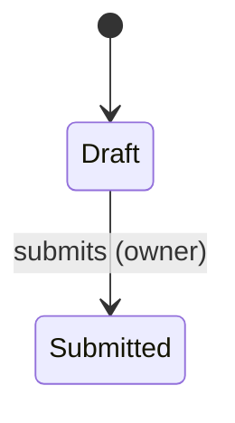

# [Initiative] — F[N]: [feature code-name]

> **How to use:** Copy for your feature as `PRDs/{area}/{initiative-slug}-{feature-slug}-brief.md`. For guided creation run `/feature-brief` — it reads this file fresh each run as the document contract: section order, table shapes, and register rules come from here. `>` blockquotes are guidance to the drafting agent — never emitted into the document.
>
> **What this document is:** the buildable contract for ONE feature — the level between the PRD (why this bet) and tickets (who builds what). It describes what a user must be able to do and why: clear enough that the build can't get it wrong, open enough that design and engineering find the best way. No layout, no components, no copy, no implementation-how — `[code-names]` for anything that needs a label.
>
> **Proportionality rule:** all 16 core sections exist — a non-applicable one carries one line saying why. Depth follows risk × novelty × variation count, never habit: an Integration-type feature legitimately produces 2–3 pages; a risky net-new stateful feature earns full depth. Conditional sections (rules comment at the bottom) appear only when their trigger fires.
>
> **Evidence labels:** every load-bearing claim carries one — `[Evidenced]` (source named) · `[Partial]` (signal, not proof) · `[Hypothesis — needs validation]`. Undecided capabilities are flagged, never invented.

[One line: what this feature is, in plain words.]

| ID | Type | Parent | Effort | Priority — why | Depends on | Status | Updated |
|----|------|--------|--------|----------------|-----------|--------|---------|
| F-[N] | Integration / Net new / Enhancement | [PRD](link) · [breakdown](link) | [Eng to confirm] | Must — [reason] | F-[M] | Draft / Agreed / Handed off | [YYYY-MM-DD] |

## 1) Why this exists

> The root cause, not the feature pitch: what is broken or missing today, with current-state facts (code-verified where possible — "the flag already exists in [module]; it just isn't visible here"). 1–2 paragraphs.

## 2) Outcome

> The change in what people DO, not the thing shipped. "Managers clear approvals the same day," not "an approvals dashboard."

## 3) Job story

> When [situation], I want to [motivation], so I can [outcome]. Intent only — the middle clause is never a UI action. One primary story here; per-variation stories go in §5 only when they materially differ.

## 4) The slice

> A feature here is one thin end-to-end slice of the initiative. Four facts, no more.

**Riskiest assumption this feature tests:** [the thing we most need to find out]
**The backbone (full flow, for context):** [stage] → [stage] → [stage] → [outcome lands]
**What this slice covers:** [where it starts, where it ends, that the loop closes — or why it deliberately doesn't]
**Preconditions & inherited dependencies:** [what must be live before this starts]

## 5) Variations — who does this differently

> Mandatory verdict, never silence. Either the one-line verdict — "No material variations (checked: company size, vertical, org complexity, plan/package, region & compliance, data/integration maturity, persona, permission scope, tenure, language, accessibility needs, first-run vs steady-state, volume, timing/seasonality, migration state)" — or the table. Dispositions: **nuance** (same flow — rendered as variation-tagged rules and exception rows) · **branch** (a step materially differs — delta sub-flow below the table, the delta only) · **different job** (backbone differs end-to-end — flagged back to the breakdown as its own feature, never absorbed here). Reach is sourced, not guessed.

| Variation | Who (reach, sourced) | Differs how | Priority — grounded | In this feature? |
|-----------|----------------------|-------------|---------------------|------------------|
| [name] | [segment · N accounts / $ARR · source] | [nuance / branch / different job — one line] | [tier — reason] | [yes / deferred → F-N] |

## 6) Capabilities & flow

> What each actor must be able to do and where each action leads — places, things to act on, where actions lead. Nothing visual. New object → fields table. Stateful object → ONE simple state diagram (states + who moves them; no styling, no nested regions). Close with the flagged-not-invented line.

**Places:** [where the user can be]
**Actions:** [what they can act on, described by intent]
**Where each action leads:** [what each action causes]

**[Object] fields** (only when this feature introduces a new object):

| Field | What it is | Required / derived / system-set |
|-------|------------|--------------------------------|

**Capabilities this feature does not answer — flagged, not invented:** [the undecided ones, named as open questions in §13]

## 7) Roles & permissions

> Persona × action matrix, including every out-of-scope persona and what they get (nothing / read-only / an explanation). A persona difference with no system carrier (see `business-context/platform-model.md`) becomes a rule in §8 naming the mechanism — the build can't guess it.

| Action | [Persona A] | [Persona B] | [Out-of-scope persona] |
|--------|-------------|-------------|------------------------|

## 8) Rules & acceptance criteria

> Two registers only. **Rules** R-1…R-n — one behavior each, explicit trigger and state, each with *— Why:*. **Acceptance criteria** as checkboxes — Given/When/Then for conditional behavior (the Then is a system state or user-visible result, never a widget), flat assertions for simple invariants. Variation-tagged where §5 requires it.

**Rules:**

- **R-1** — [one behavior, explicit trigger/state]. — *Why:* [reason]

**Acceptance criteria:**

- [ ] Given [context], When [action], Then [observable result]
- [ ] [flat assertion for a simple invariant]

## 9) Constraints

> The non-negotiables the build cannot guess: compliance, money, audit, localization, data integrity. Each a rule + reason, labeled with its domain and an evidence label. Cite `business-context/platform-model.md` and `engineering/tech-constraints.md`; a presumed-constraint domain (platform-model §7) stays a constraint until its owner says otherwise.

- **[domain]** — [rule]. — *Why:* [reason]. `[Evidenced]`

## 10) Cross-cutting concerns

> Every row answered — **in this feature** (budgeted scope) or **deferred** (named risk + which later feature picks it up). Silence is the only wrong answer.

| Dimension | In this feature? | If deferred — risk + where it goes |
|-----------|------------------|-------------------------------------|
| Accessibility (keyboard, screen reader, color) | | |
| Localization — UI + system text | | |
| Notifications at every handoff | | |
| Audit & history (who / what / when) | | |
| Day-one & existing data (defaults / migration / empty states) | | |
| Permission-denied & out-of-scope personas | | |
| Plan / packaging eligibility | | |
| Limits, quota & idempotency | | |
| Timezone & calendar | | |

## 11) Exceptions — a floor, not a ceiling

> Situation → what must be true. Never UI ("show a red toast"). Expected to be incomplete — design and QA will find more; say so.

| # | When this happens… | …what must be true | Variation | Open? |
|---|--------------------|--------------------|-----------|-------|
| E1 | [situation] | [outcome that must hold] | [— or variation tag] | [? if open] |

## 12) Scope priorities & grounding

> What's in vs deferred, and why — grounded, never opinion. **Reach** = accounts / ARR / users affected, named number + source (`segmentation-matrix.md`, `portfolio.yaml`, analytics). **Frequency** = how often it bites for those affected. **Severity**: compliance / money / privacy / irreversibility auto-escalate to Must regardless of reach. **Effort is deliberately not scored** — it's Engineering's number (§14). Unevidenced Reach or Frequency → tier marked *provisional* + a research row in §13. This table sets the feature boundary; build order lives in the breakdown.

| Item | Reach (sourced) | Frequency | Severity | Evidence | Tier | In / deferred → where |
|------|-----------------|-----------|----------|----------|------|------------------------|

## 13) Open questions & research needed

> Every open question, provisional priority, and unverified assumption gets an owner and a best-method route: interviews → `/interview-guide` (suggested, never auto-run) · existing corpus → `/user-research-synthesis` or direct read · reach & baselines → `segmentation-matrix.md` / analytics · competitors → `/competitor-analysis` · feasibility → `/code-qa` or `[TODO: eng consult]`. Questions are about the need, never the UI.

| # | Question | Blocks | Owner | Best method → route | Status |
|---|----------|--------|-------|---------------------|--------|

## 14) Engineering confirmations needed

> What Engineering answers before scope and priorities are committed: does the assumed endpoint / component exist ("already live in [system] — confirm the same endpoint is consumed here; **do not re-implement**"), atomic-transaction and migration questions, effort ranges per Must-tier item. Confirmed answers get folded into `engineering/tech-constraints.md` §7.

- [ ] [endpoint / component existence — do-not-re-implement class]
- [ ] [atomic-transaction / data-migration question]
- [ ] Effort ranges per Must-tier item

## 15) How we'll know it worked

> Behavior change expected · leading signal (fast) · lagging signal (real value) · guardrail (must not get worse) · how these confirm or kill §4's riskiest assumption. Split by segment when the evidence base is segment-skewed. Deep-dive: `/feature-metrics`.

- **Behavior we expect to change:** …
- **Leading signal:** …
- **Lagging signal:** …
- **Guardrail:** …
- **Riskiest-assumption tie-in:** …

## 16) Out of scope & sequencing

> Each exclusion names its future feature (or "deliberately never, because…") and why later beats now. §5's different-job flags and §10's deferrals land here.

- [exclusion] — [future feature F-N / never] — [why later]

---

**Definition of done (delivery seam):** all ACs met · code review · QA on supported browsers · accessibility check · staging verified · PM sign-off.

**Evidence & traceability:** PRD goal this serves: [link] · Sources this brief leans on: [links]

**Quality gate** (the single checklist — checked by `/feature-brief` before presenting; recheck on manual edits):

- [ ] Passes the four pressure tests: outcome-changing · standalone-shippable · vertical · scope-sane
- [ ] Altitude: no visual design, copy, component choice, implementation-how, or effort numbers; UI nouns only for existing platform surfaces or `[code-names]`
- [ ] No widgets in any Then
- [ ] Every capability has ≥1 rule or AC backing it
- [ ] Every state in §6's diagram is reachable and exitable, with a named mover
- [ ] Every §10 row answered; every §11 exception has an outcome or an explicit `?`
- [ ] Every §5 variation dispositioned (nuance / branch / different job / not material)
- [ ] Every §12 priority grounded in a sourced number or marked provisional with a §13 row
- [ ] Every §13 question has an owner and a route; §14 lists what Engineering must confirm
- [ ] Ambiguity lint: no bare "should", "fast", "easy", "handle", "appropriate", "etc." as requirement language (§12's Must/Should/Could tier labels are vocabulary, not violations)
- [ ] Traces to a named PRD goal; nothing invented where evidence is absent — flagged instead

<!--
Template rules (keep this comment):
- Conditional sections — add ONLY when the trigger fires, placed after the section that feeds them:
  · Definitions (after the intro line) — the feature introduces novel terms
  · Committed solutions (after §9) — a mechanism the team has genuinely agreed is the only viable
    path, each stamped: serves capability · why the only path · agreed by · date. Rare — the
    default is a capability, not a Commit.
  · Risks & break points (after §11) — high-risk feature: irreversibility, money, privacy
    ("highest-risk job — extra QA; atomic-transaction question answered before dev starts")
  · Competitive notes (after §12) — a market sweep ran (`/feature-brief --market`)
  · Handoff note (at the very end) — handoff to BA/dev is imminent
- Living doc: edit in place, bump the Updated cell. Challenge reports live in
  `PRDs/{area}/reviews/`, never inside this file.
- The section order IS the method's spine (why → outcome → job → slice → variations →
  capabilities → rules → constraints → cross-cutting → priorities → research → eng → measures).
  Skills follow it; don't re-order per feature.
-->
